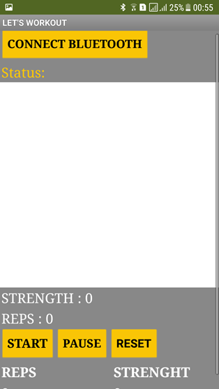
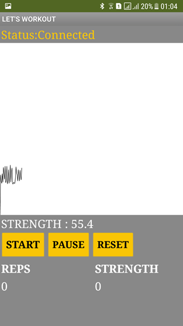
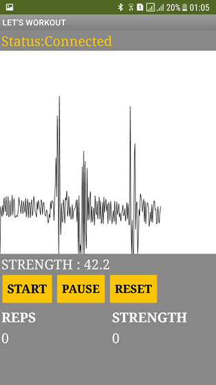

# Medical SOC (System on a Chip) Application Project, App Inventor, Course project
Demo video link: https://www.youtube.com/watch?v=2J7q3ZClEKQ

medicalchip_1_4.aia: App Inventor file, for uploading to App Inventor website and edit the design.
medicalchip_1_4.apk: App Inventor file, an app file for uploading to Android Smartphones.
FinalReport_MedicalChip.pdf: ppt report (Chinese).

 
	Main page showing EMG signals
 

 
	EMG signal graphs
	
	